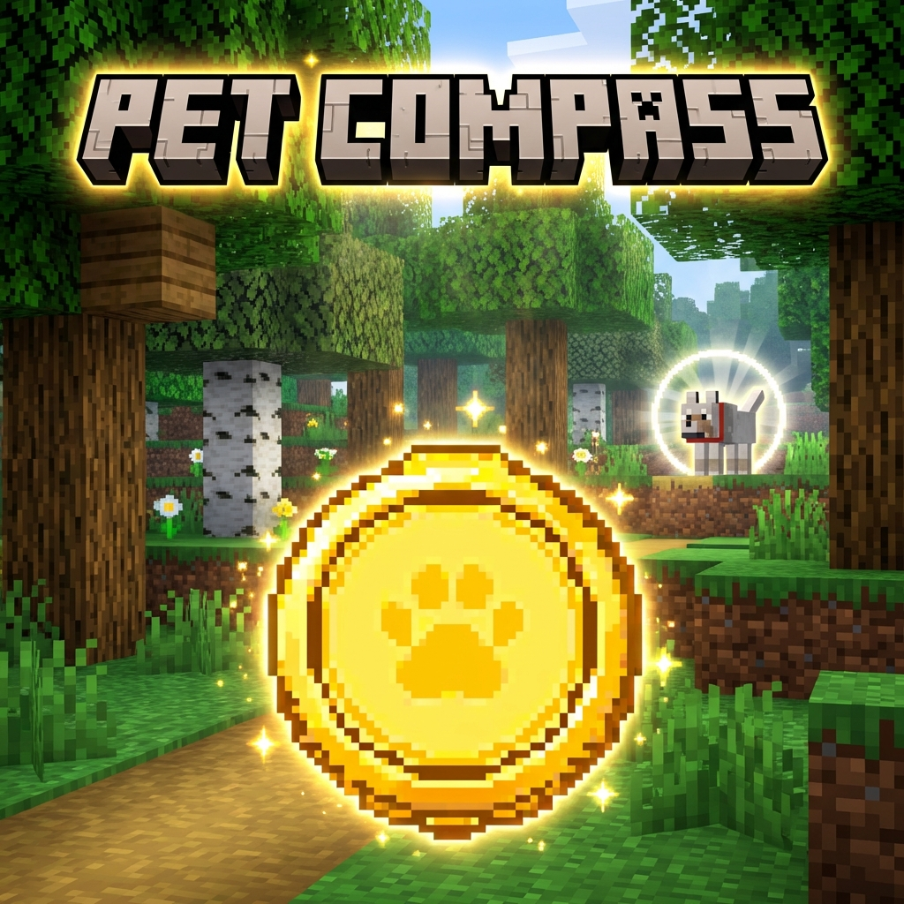

  

  # Pet Compass

  
  

A simple NeoForge 1.21.x mod that adds a **Pet Compass** to help you find your lost companions.

## Features

-   **Pet Compass Item**: A beautiful, custom-designed compass.
-   **Pet Selection GUI**: Browse all your tamed pets with search functionality.
-   **Cross-Dimension Tracking**: Find pets even in the Nether, End, or modded dimensions.
-   **Unloaded Chunk Support**: Locate pets in chunks that aren't loaded.
-   **Distance Display**: See how far away your pet is.
-   **Glowing Effect**: Your tracked pet glows when you get close.

## How to use

1.  Craft or find the **Pet Compass** in the Creative "Tools & Utilities" tab.
2.  **Right-click** to open the pet selection GUI.
3.  Select a pet from the list and click "Track".
4.  Follow the compass needle to find your pet!
5.  **Shift + Right-click** to reset the compass.

## Installation

1.  Download from [CurseForge](https://www.curseforge.com/minecraft/mc-mods/pet-compass).
2.  Place the `.jar` file in your `mods` folder.
3.  Make sure you have NeoForge 21.1.x installed.

## Supported Versions

| Minecraft | Loader | Status |
|-----------|--------|--------|
| 1.21.x | NeoForge | ✅ Available |
| 1.20.x | NeoForge | 🔜 Coming Soon |
| 1.20.x | Forge | 🔜 Coming Soon |
